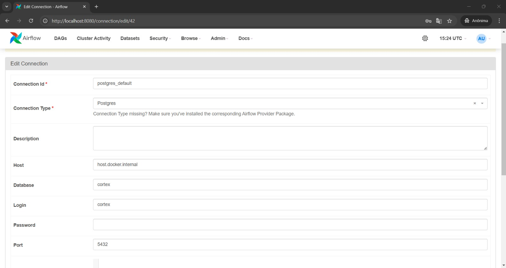
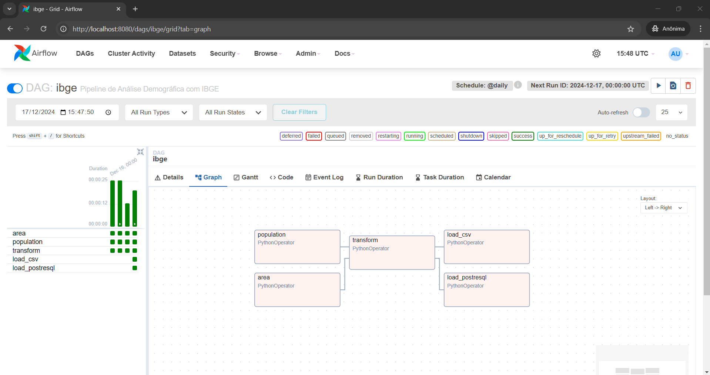

# Pipeline de Análise Demográfica do Brasil com Dados IBGE 🗺️📊

Este projeto implementa um pipeline de análise demográfica do Brasil utilizando dados do IBGE, integrando ferramentas como Apache Airflow, Pandas e PostgreSQL. O pipeline coleta, transforma e carrega informações de área territorial e população para fornecer insights ricos sobre densidade populacional e distribuição demográfica.

## 🛠️ Estrutura do Projeto

### Arquivos e Diretórios
- **`dags/`**: Contém a DAG principal do Airflow e os scripts de ETL.
  - **`ibge.py`**: Define o pipeline no Apache Airflow.
  - **`data/`**: Contém os arquivos de entrada:
    - `AR_BR_RG_UF_RGINT_MES_MIC_MUN_2022.xls`: Dados de área territorial.
    - `tabela6579.xlsx`: Dados populacionais.
  - **`outputs/`**: Diretório para os arquivos processados.
  - **`scripts/`**: Scripts para as etapas do pipeline.
    - **`extract.py`**: Coleta dos dados brutos.
    - **`transform.py`**: Transformação dos dados.
    - **`load.py`**: Salva os resultados em CSV e carrega no banco de dados.
- **`docker-compose.yml`**: Configuração para executar o Airflow e PostgreSQL com Docker.
- **`requirements.txt`**: Dependências do projeto.

#### Fontes de Dados

- [Área](https://geoftp.ibge.gov.br/organizacao_do_territorio/estrutura_territorial/areas_territoriais/2022/AR_BR_RG_UF_RGINT_MES_MIC_MUN_2022.xls)
- [População](https://sidra.ibge.gov.br/tabela/6579)

### Fluxo do Pipeline

O pipeline é composto pelas seguintes tarefas, definidas na DAG `ibge`:

1. **`extract_area`**: Extrai dados de área territorial.
2. **`extract_population`**: Extrai dados populacionais.
3. **`transform`**: Combina e processa os dados extraídos.
4. **`load`**: Salva os dados processados em um arquivo CSV e no banco de dados PostgreSQL.

## 🚀 Configuração e Execução

### Pré-requisitos
- Docker
- Docker Compose
- Python 3.8+

### Passos para Execução

1. Clone este repositório:

   ```bash
   git clone https://github.com/nandopesilva/cortex-case
   ```
   
2. Inicie os serviços com Docker Compose:

    ```bash
    docker-compose --project-name case up -d 
    ```

3. Acesse a interface do Airflow em [http://localhost:8080](http://localhost:8080) com as credenciais:

- **Usuário:** admin
- **Senha:** admin

4. Configure a conexão do Airflow com o banco de dados PostgreSQL:

- **Connection:** postgres_default
- **Host:** host.docker.internal 
- **Database:** cortex 
- **Login:** cortex 
- **Password:** cortex 
- **Port:** 5432



5. Executando a DAG:



6. 🧑‍💻 Tecnologias Utilizadas

- **Apache Airflow:** Orquestração do pipeline.
- **Docker:** Ambiente de desenvolvimento isolado.
- **Pandas:** Manipulação e transformação de dados.
- **PostgreSQL:** Armazenamento dos resultados.
